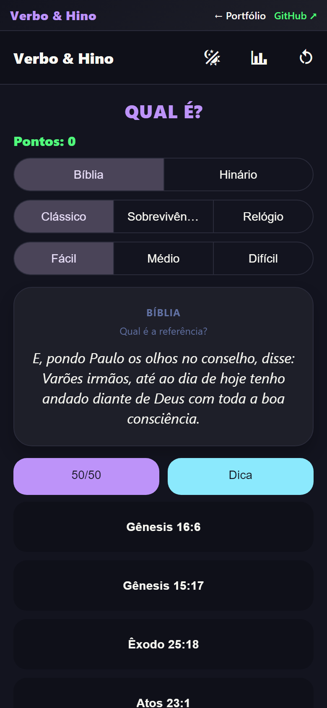
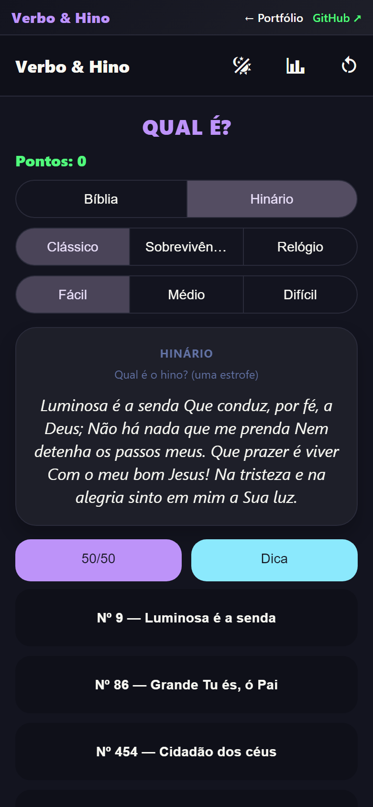
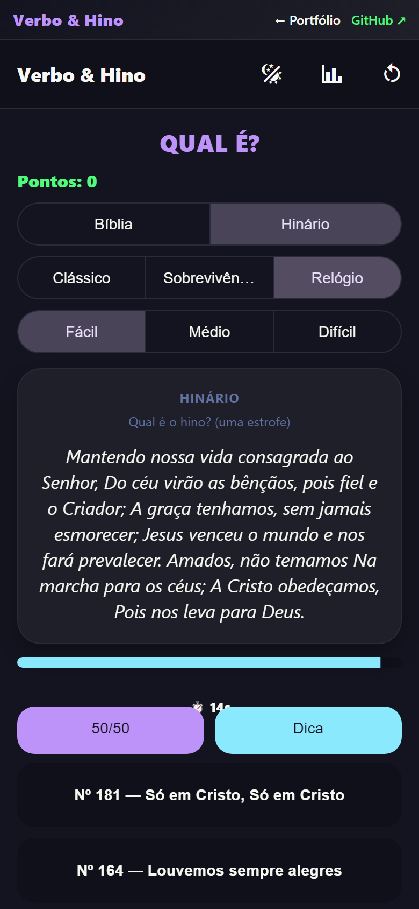
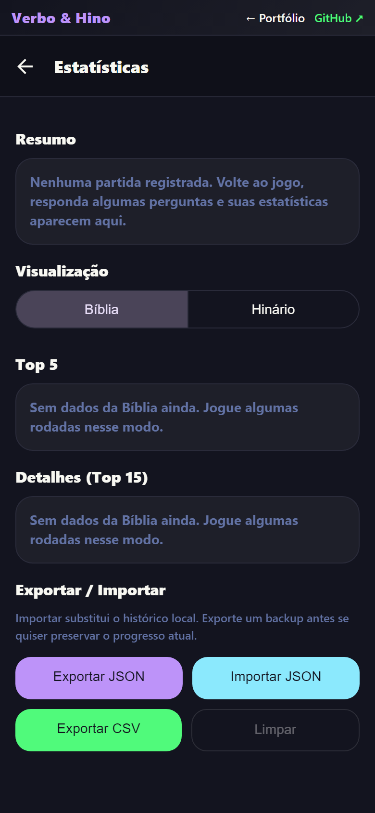
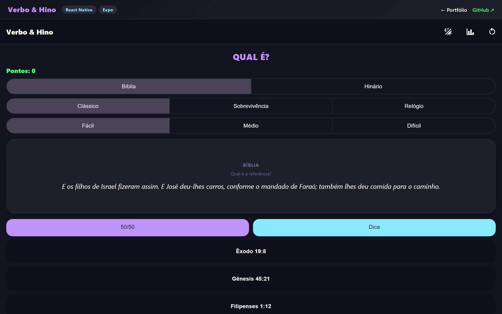

<div align="center">
  

  <h1>Verbo & Hino</h1>

  <p><strong>Gamificação do aprendizado cristão — quizzes offline de Bíblia (ARC) e Hinário CCB.</strong></p>
  <p><strong>Christian learning, gamified — offline Bible (ARC) and CCB hymnal quizzes.</strong></p>

  <p>
    <a href="#pt-br">PT-BR</a>
     · 
    <a href="#english">English</a>
     · 
    <a href="#live-demo">Live Demo</a>
     · 
    <a href="#stack">Stack</a>
     · 
    <a href="#architecture">Architecture</a>
     · 
    <a href="#quick-start">Quick Start</a>
     · 
    <a href="#author">Author</a>
  </p>

  <p>
    
    
    
    
    
  </p>

  <p>
    <a href="https://verbo-hino.vercel.app"><strong>Live Demo</strong></a>
     · 
    <a href="https://github.com/BarujaFe1/VerboHino"><strong>Repo</strong></a>
     · 
    <a href="https://barujafe.vercel.app/"><strong>Portfolio</strong></a>
     · 
    <a href="https://www.linkedin.com/in/barujafe/"><strong>LinkedIn</strong></a>
  </p>
</div>


> **Product note:** Expo/React Native app with a **web demo** on Vercel. Content is for study/gamification — not an official CCB publication channel.

---

## PT-BR

### Visão geral
O **Verbo & Hino** gamifica o estudo com quizzes da Bíblia (ARC) e do Hinário CCB: modos Clássico, Sobrevivência e Relógio, dificuldades, estatísticas, exportação e temas claro/escuro.

### Problema
Memorização e revisão de hinos/versículos costumam ser manuais e pouco motivadoras — sem feedback rápido nem histórico.

### Para quem
Membros e estudantes que querem treinar Bíblia/hinário de forma leve no celular (ou no demo web).

### Funcionalidades
- Quizzes de Bíblia e Hinário
- Modos Clássico, Sobrevivência e Relógio
- Níveis de dificuldade e estatísticas
- Exportação de dados e tema claro/escuro
- Demo web (Expo web) em Vercel

### Escopo e limites (honestos)
- App de estudo/gamificação — **não** substitui materiais oficiais da congregação
- Web demo pode diferir do app nativo em APIs de device
- Conteúdo e licenciamento de textos: use de acordo com as fontes embutidas no projeto

---

## English

### Overview
**Verbo & Hino** gamifies study with Bible (ARC) and CCB hymnal quizzes: Classic, Survival and Clock modes, difficulties, stats, export and light/dark themes.

### Problem
Hymn/verse practice is often manual and unmotivating — little feedback and no history.

### Who it is for
Members and learners who want light Bible/hymnal practice on mobile (or the web demo).

### Features
- Bible and hymnal quizzes
- Classic, Survival and Clock modes
- Difficulty levels and statistics
- Data export and light/dark theme
- Expo web demo on Vercel

### Scope and honest limits
- Study/gamification app — **not** an official congregational publication
- Web demo may differ from native device APIs
- Respect embedded source/licensing of texts in the repo

---

## Live Demo

| Surface | URL |
|---|---|
| **Public lab** | [https://verbo-hino.vercel.app](https://verbo-hino.vercel.app) |
| **GitHub** | see Repo badge above |

**How to try:** pick Bible or Hymnal → play a mode → check stats → try dark/light theme.


## Screenshots

<table>
  <tr>
    <td width="50%"><br /><sub><strong>Bible quiz</strong></sub></td>
    <td width="50%"><br /><sub><strong>Hymnal quiz</strong></sub></td>
  </tr>
  <tr>
    <td width="50%"><br /><sub><strong>Time attack</strong></sub></td>
    <td width="50%"><br /><sub><strong>Stats</strong></sub></td>
  </tr>
  <tr>
    <td width="50%"><br /><sub><strong>Desktop web</strong></sub></td>
    <td width="50%"></td>
  </tr>
</table>


## Stack

| Layer | Technology |
|---|---|
| App | Expo 54, React Native, TypeScript |
| Demo | Expo web on Vercel |

---

## Architecture

See [`docs/ARCHITECTURE.md`](./docs/ARCHITECTURE.md) for deeper notes. High level: quiz engines + local stats + optional web export.

---

## Quick Start

```bash
npm install
npx expo start
```

Web: follow Expo web scripts used for the Vercel demo.

---

## Technical decisions

- **Offline-friendly quiz loop** for study without constant network
- **Multiple modes** to vary practice pressure (classic vs clock)
- **Web demo** for portfolio reviewers without installing APK

---

## Roadmap

- Richer stats and review of wrong answers
- Content packs / difficulty tuning
- Native distribution polish

---

## Author

**Felipe Alirio Baruja** — data / product / full-stack portfolio.

- Portfolio: [https://barujafe.vercel.app/](https://barujafe.vercel.app/)
- GitHub: [https://github.com/BarujaFe1](https://github.com/BarujaFe1)
- LinkedIn: [https://www.linkedin.com/in/barujafe/](https://www.linkedin.com/in/barujafe/)


## License

MIT — see [`LICENSE`](./LICENSE).
